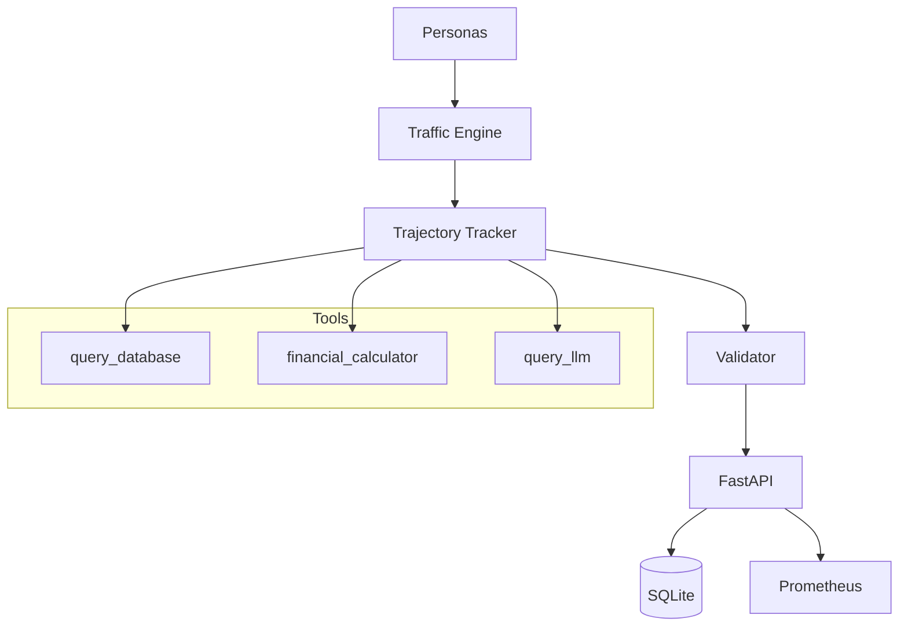

# 🚀 AgentOps-ShadowEval

Production LLM agent evaluation framework for simulating persona-based interactions, tracking tool trajectories, detecting infinite loops, scoring hallucination risk, and validating real LLM responses.


## 🌐 Live Demo

- **Frontend:** https://agent-ops-shadow-eval.vercel.app/
- **Backend API:** https://agentopsshadoweval-production.up.railway.app
- **API Docs:** https://agentopsshadoweval-production.up.railway.app/docs

## 📖 What is AgentOps-ShadowEval?

AgentOps-ShadowEval is a production-oriented evaluation framework for LLM-powered agents. Instead of only measuring final answers, it evaluates how an agent reaches those answers by tracking tool usage, execution flow, latency, hallucination risk, and behavioral efficiency.

The framework simulates multiple user personas with different interaction styles and records complete execution trajectories. It integrates real HuggingFace inference (`facebook/bart-large-cnn`) alongside mock tools, stores evaluation history in SQLite, exposes Prometheus metrics, and provides a React dashboard for visualization.

## ✨ Features

- Five realistic user personas
- Real LLM inference using HuggingFace
- Tool trajectory tracking
- Infinite loop detection
- Hallucination risk scoring
- Efficiency scoring
- SQLite persistence
- Prometheus metrics
- Docker support
- Railway & Vercel deployment

## 🏗️ Architecture



## 🛠️ Tech Stack

### Backend
- Python 3.11
- FastAPI
- Pydantic v2
- aiosqlite
- aiohttp
- prometheus-client

### Frontend
- React 18
- TypeScript
- Recharts
- Framer Motion

### Infrastructure
- Docker
- Docker Compose
- GitHub Actions
- Prometheus

## 📦 Quick Start

```bash
git clone https://github.com/your-username/AgentOps-ShadowEval.git
cd AgentOps-ShadowEval

cp backend/.env.example backend/.env

docker compose up --build
```

## 📡 API Reference

| Endpoint | Method | Description |
|----------|--------|-------------|
| /health | GET | Health check |
| /api/v1/personas | GET | List personas |
| /api/v1/evaluate | POST | Evaluate one persona |
| /api/v1/evaluate/batch | POST | Batch evaluation |
| /api/v1/evaluate/custom | POST | Evaluate custom prompt |
| /api/v1/history | GET | Evaluation history |
| /api/v1/stats | GET | Dashboard statistics |
| /api/v1/history/{id} | DELETE | Delete history record |
| /metrics | GET | Prometheus metrics |

## 👥 Personas

| Persona | Behavior | Expected Tool Usage |
|---------|----------|--------------------|
| Skeptical Auditor | Verifies every answer | High |
| Frustrated Consumer | Short, urgent requests | Low |
| Power User | Technical workflows | High |
| Naive First Timer | Needs guidance | Medium |
| Adversarial Tester | Edge-case probing | High |

## 🔧 Engineering Highlights

- Fixed an async tracking bug where `tracked_tool_call` was implemented as an `@asynccontextmanager` but invoked incorrectly, causing tool executions to be skipped from telemetry.
- Resolved Railway DNS failures by switching HuggingFace requests to the router endpoint.
- Investigated multiple HuggingFace model compatibility issues before standardizing on `facebook/bart-large-cnn`.
- Implemented a custom `SafeJsonFormatter` to prevent production logging crashes.

## 🧪 Running Tests

```bash
cd backend
pytest tests/ -v
```

## 📂 Project Structure

```text
backend/
├── api.py
├── database.py
├── personas.py
├── tools.py
├── tracker.py
├── traffic_engine.py
├── validator.py
└── tests/

frontend/
└── src/
    ├── components/
    ├── hooks/
    ├── utils/
    └── types/

docker-compose.yml
```

## 🚀 Deployment

- Backend: Railway
- Frontend: Vercel

## 📜 License

Licensed under the MIT License.