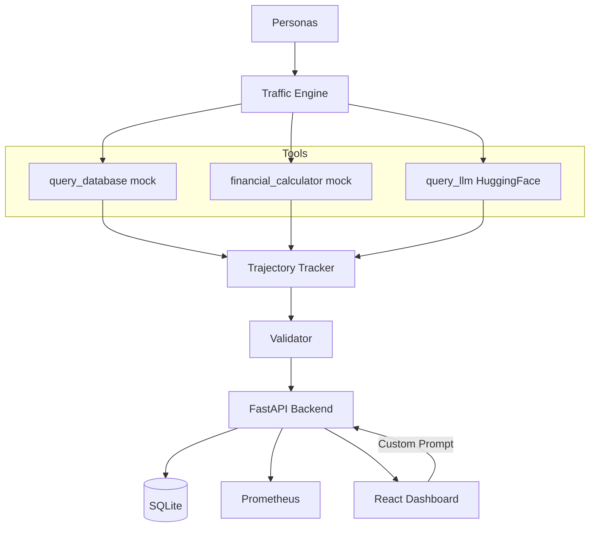

# AgentOps-ShadowEval

Production LLM agent evaluation framework. Simulates persona-based interactions,
tracks tool trajectories, detects infinite loops, scores hallucination risk,
and validates real LLM responses via HuggingFace inference.

[](https://github.com/Kashish-2005/AgentOps_ShadowEval/actions/workflows/ci.yml)


---

## Live Demo

- **Frontend:** https://agent-ops-shadow-eval.vercel.app/
- **Backend API:** https://agentopsshadoweval-production.up.railway.app
- **API Docs:** https://agentopsshadoweval-production.up.railway.app/docs

---

## What is AgentOps-ShadowEval?

AgentOps-ShadowEval is a production-oriented evaluation framework for
LLM-powered agents. Instead of only measuring final answers, it evaluates
how an agent reaches those answers — tracking tool usage, execution flow,
latency, hallucination risk, and behavioral efficiency across a complete
agent trajectory.

The framework simulates five distinct user personas with different interaction
styles and risk tolerances, records complete execution trajectories through
a trajectory tracker, integrates real HuggingFace inference
(facebook/bart-large-cnn) alongside deterministic mock tools, persists
evaluation history in SQLite with WAL mode for concurrent write safety,
exposes Prometheus metrics for observability, and provides a React dashboard
for real-time visualization. Real users can also submit their own prompts
directly through the custom evaluation endpoint.

---

## Architecture



---

## Tech Stack

**Backend:** Python 3.11, FastAPI, Pydantic v2, aiosqlite, aiohttp,
prometheus-client, python-json-logger

**Frontend:** React 18, TypeScript, Recharts, Framer Motion

**Infrastructure:** Docker, Docker Compose, GitHub Actions CI,
Prometheus, Railway, Vercel

---

## Quick Start

```bash
git clone https://github.com/Kashish-2005/AgentOps_ShadowEval.git
cd AgentOps_ShadowEval

cp backend/.env.example backend/.env
# Add your HUGGINGFACE_API_KEY to backend/.env

docker compose up --build
# Frontend:   http://localhost:80
# Backend:    http://localhost:8000
# Prometheus: http://localhost:9090
```

---

## API Reference

| Method | Endpoint | Description |
|--------|----------|-------------|
| GET | /health | Health check with version and environment |
| GET | /api/v1/personas | List all 5 registered personas |
| POST | /api/v1/evaluate | Run single persona simulation |
| POST | /api/v1/evaluate/batch | Run all personas concurrently |
| POST | /api/v1/evaluate/custom | Evaluate a real user-submitted prompt via LLM |
| GET | /api/v1/history | Fetch evaluation history with optional persona filter |
| GET | /api/v1/stats | Aggregate dashboard statistics |
| DELETE | /api/v1/history/{id} | Delete a single evaluation record |
| GET | /metrics | Prometheus metrics scrape endpoint |

---

## Personas

| Key | Display Name | Behavior | Expected Tool Calls |
|-----|-------------|----------|-------------------|
| skeptical_auditor | Skeptical Auditor | Verifies every claim, demands logical proof | 4 |
| frustrated_consumer | Frustrated Consumer | Short, impatient, urgent requests | 1 |
| power_user | Power User | Complex multi-step technical workflows | 6 |
| naive_first_timer | Naive First-Timer | Verbose, provides too much irrelevant context | 1 |
| adversarial_tester | Adversarial Tester | Deliberately probes edge cases and malformed inputs | 3 |

---

## Prometheus Metrics

| Metric | Type | Description |
|--------|------|-------------|
| agent_execution_latency_seconds | Histogram | End-to-end latency per persona run, labeled by persona |
| api_error_total | Counter | Total API errors, labeled by error type and endpoint |
| estimated_usd_cost_total | Gauge | Cumulative estimated USD cost based on token usage |
| active_evaluations | Gauge | Number of evaluations currently in progress |

---

## Engineering Highlights

**Critical async bug fix:** `tracked_tool_call` was implemented as an
`@asynccontextmanager` generator but called throughout the codebase as a
plain `await`-ed coroutine. Python silently creates and discards async
generators when awaited instead of entering them with `async with`, meaning
every tool call appeared to succeed (the tool name was appended to
`tool_sequence`) but `tracker.record()` was never actually called. The result
was evaluations showing `total_tool_calls: 0` with `latency_ms` under 1ms
despite supposedly executing multiple tools. Fixed by removing the context
manager decorator and converting to a plain async function that returns the
result directly.

**Production DNS debugging on Railway:** HuggingFace requests failed with
`getaddrinfo failed` on `api-inference.huggingface.co`. Isolated this as a
Railway-specific DNS resolution failure by confirming the same code worked
against other hostnames. Fixed by switching to the HuggingFace router
endpoint (`router.huggingface.co`) which resolves correctly from Railway's
container network.

**Model compatibility resolution:** The router endpoint returned HTTP 400
`Model not supported by provider hf-inference` for `google/flan-t5-base`.
Systematically tested alternative models and standardized on
`facebook/bart-large-cnn` which is confirmed supported by the hf-inference
provider on the router endpoint.

**Production JSON logging crash:** `pythonjsonlogger`'s `rename_fields`
parameter raised `KeyError: 'levelname'` on every log statement in production,
flooding Railway deploy logs with tracebacks while actual log content was
lost. Fixed by implementing a custom `SafeJsonFormatter` subclass that reads
`levelname` directly from the `LogRecord` object attribute (always present)
rather than relying on it being pre-populated in the formatted dict.

---

## Running Tests

```bash
cd backend
pip install -r requirements-dev.txt
pytest tests/ -v
# 31 tests covering tools, tracker, and validator
```

---

## Project Structure
AgentOps_ShadowEval/
├── backend/
│   ├── api.py               # FastAPI routes + Prometheus metrics
│   ├── config.py            # Pydantic Settings, env var management
│   ├── database.py          # aiosqlite persistence + WAL mode
│   ├── logging_config.py    # Structured JSON logging + request ID tracing
│   ├── personas.py          # 5 persona profile definitions
│   ├── tools.py             # query_database, financial_calculator, query_llm
│   ├── tracker.py           # TrajectoryTracker + loop detection
│   ├── traffic_engine.py    # Async simulation orchestration
│   ├── validator.py         # Scoring rules + EvaluationReport
│   ├── requirements.txt     # Pinned production dependencies
│   ├── requirements-dev.txt # Dev + test dependencies
│   ├── pyproject.toml       # Pytest + ruff + mypy config
│   └── tests/               # 31 pytest tests
│       ├── conftest.py
│       ├── test_tools.py
│       ├── test_tracker.py
│       └── test_validator.py
├── frontend/
│   └── src/
│       ├── components/      # Header, PersonaForm, ResultsTable,
│       │                    # MetricsChart, LiveFeed, StatCard, Toast
│       ├── hooks/           # useToast
│       ├── utils/           # ApiClient, format helpers
│       └── types/           # TypeScript interfaces
├── .github/
│   └── workflows/
│       └── ci.yml           # Backend tests + frontend typecheck + Docker smoke test
├── docker-compose.yml
├── prometheus.yml
└── Makefile
---

## Deployment

**Backend** deployed on Railway with SQLite persisted to a mounted `/data`
volume. Environment variables managed through Railway's dashboard including
`HUGGINGFACE_API_KEY`, `USE_REAL_LLM`, and `HUGGINGFACE_MODEL`.

**Frontend** deployed on Vercel with automatic deploys on every push to main.
`VITE_API_BASE_URL` points to the Railway backend URL.

**CI/CD** via GitHub Actions runs backend pytest suite, TypeScript type
checking, and a Docker smoke test on every push to main and every pull request.

---

## Screenshots

_Add screenshots to docs/screenshots/ after capturing the live app._

---

## License

MIT